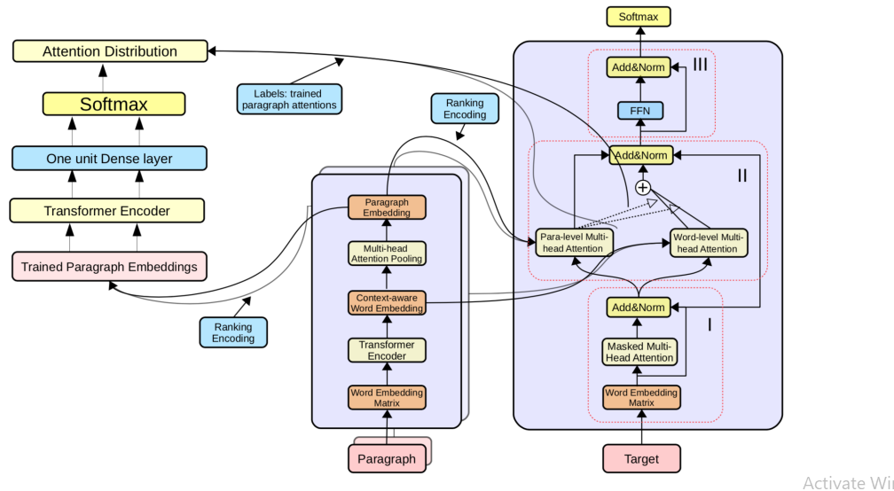

# Parallel Hierarchical Transformer 
[Paper]()
> This repository consists of code for the Parallel Hierarchical Transformer with Attention Alignment for Abstractive Multi-Document Summarization.
> The architecture is based on the research paper presented by [Ye Ma](https://paperswithcode.com/search?q=author%3AYe+Ma) and [Lu Zong](https://paperswithcode.com/search?q=author%3ALu+Zong). In this paper, focus has been on the abstractive Multi-Document Summarization (MDS).
> Attention Alignment algorithm first predicts the optimal attention distribution of source paragraphs, then regulates the beam search according to the scoring function derived from the predicted attention distribution.
---
* Note that the attention-alignment mechanism is implemented after the training of PHT, and this repository focuses solely upon the implementation of the architecture.
---

## Description

In comparison to single-document summarization, abstractive Multi-Document Summarization (MDS) brings challenges on the representation and coverage of its lengthy and linked sources. This study develops a Parallel Hierarchical Transformer (PHT) with attention alignment for MDS. 

By incorporating word- and paragraph-level multi-head attentions, the hierarchical architecture of PHT allows better processing of dependencies at both token and document levels. To guide the decoding towards a better coverage of the source documents, the attention-alignment mechanism is then introduced to calibrate beam search with predicted optimal attention distributions. 

Based on the WikiSum data, a comprehensive evaluation is conducted to test improvements on MDS by the proposed architecture. By better handling the inner- and cross-document information, results in both ROUGE and human evaluation suggest that our hierarchical model generates summaries of higher quality relative to other Transformer-based baselines at relatively low computational cost.

## Architecture 

## Tech

The tech that is needed for this project:

- [PyTorch](https://pytorch.org/) - Deep Learning Library for Neural Networking.
- [Math](https://pypi.org/project/python-math/) - Yup. it is a library for mathematical calculations
- [VS code](https://code.visualstudio.com/) - I prefer VS code but any other code editor will work

## License

This work was supported by Xi’an Jiaotong-Liverpool University Key Programme Special Fund KSF-A-14.